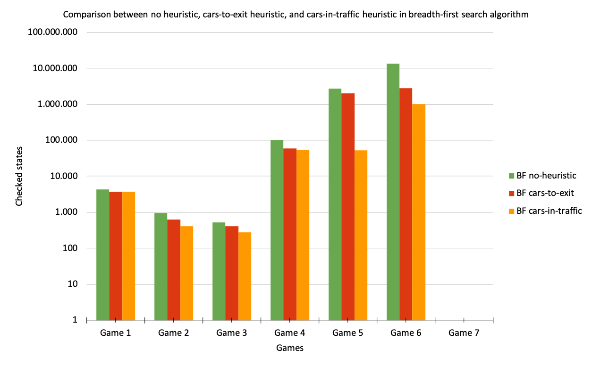

# Results
## Calculating the state space and the bounds of the objective function
#### State space
To calculate the upper bound of our **state space**, we used the following formula:  

  _upper bound = (field size - 1)^cars_ * _(field size - 2)^trucks_  

  As a car has a length of 2, it can move 1 step less than the total size of the
field. A truck has a length of 3, so it cannot move more than 2 steps less than
the size of the field.

However, the resulting upper bound is an overestimation. To calculate the state space of the game, we allowed the vehicles to overlap. In fact, the vehicles are not allowed to overlap, so the actual state space will be smaller than the function suggests. To level off this upper bound, especially for the larger fields, we calculated new state spaces, taking into account that vehicles in the same row or column block each other in every state. 

The table below shows this upper bound of our state space for each game.

||Game 1|Game 2|Game 3|
|---| :--- | :--- | :---|
|_State Space_|Lower: 34|Lower: 16|Lower: 22|
||Upper: 1.000.000|Upper: 45.562.500|Upper: 9.112.500|

||Game 4|Game 5|Game 6|
|:---|:---| :---| :---|
|_State Space_|Lower: |Lower: |Lower: |
||Upper: 1,72E13|Upper: 8,43E18|Upper: 1,65E19|

||Game 7|
|:---|:---|
|_State Space_|Lower: |
||Upper:1,32E36|

#### Objective function
As we could not find a way to calculate the upper and lower bound of the objective function of the game Rush Hour
as a whole is, we decided to establish the upper and lower bound of the objective function when our heuristics are
used. This rendered the following results:

In our first heuristic, a malus point is given for each car blocking the red car's way to the exit. As the length
of the red car is 2, the highest amount of vehicles between the red car and the exit is equal to the width of the board minus 2.
This is how we established the upper bound of the objective function for heuristic 1: 4 for a 6x6 game, 7 for a 9x9 game, and 10 for a 12x12 game. The ideal scenario would be having no vehicles blocking the red car from exiting.
Thus, the lower bound of the objective function for this heuristic is always 0.

In our second heuristic, we looked at the blockage caused by vehicles. A more detailed description can be found below, in the
section on comparing algorithms and heuristics. One point is awarded for each vehicle that could not move. Thus, the minimum would, again, be 0; in this case, the red car would be able to exit. The maximum amount of malus points depends on the amount of cars on the board. It is highly unlikely that every car is blocked, but the worst case scenario is that only one car can move. In this case, the amount of malus points given to this board would be the number of cars minus one: every car is blocked, except for one.

||Game 1|Game 2|Game 3|
|---| :--- | :--- | :---|
|_Objective function cars-to-exit_|Lower: 0|Lower: 0|Lower: 0|
||Upper: 4|Upper: 4|Upper: 4|
|_Objective function cars-in-traffic_|Lower: 0|Lower: 0|Lower: 0|
||Upper: 8|Upper: 12|Upper: 12|

||Game 4|Game 5|Game 6|
|:---|:---| :---| :---|
|_Objective function cars-to-exit_|Lower: 0|Lower: 0|Lower: 0|
||Upper: 7|Upper: 7|Upper: 7|
|_Objective function cars-in-traffic_|Lower: 0|Lower: 0|Lower: 0|
||Upper: 22|Upper: 23|Upper: 25|

||Game 7|
|:---|:---|
|_Objective function cars-to-exit_|Lower: 0|
||Upper: 10|
|_Objective function cars-in-traffic_|Lower: 0|
||Upper: 43|

  
## Comparing algorithms and heuristics
To solve the Rush Hour puzzles, we used three different algorithms. First, to get a grasp
of the size of our problem, we used a random solver. Later on, we also implemented
a branch and bound paradigm to narrow the scope when searching for a solution.

To find the lowest amount of steps to the solution, we used a breadth-first search algorithm. This algorithm rendered viable solutions when executed on 6x6 and 9x9 boards. However, as of game 5 and game 6, the algorithm would check millions of states before arriving at the solution.

To minimise the amount of checked states, we implemented two different heuristics. Firstly, the **cars-to-exit** heuristic, and secondly the **cars-in-traffic** heuristic.

The **cars-to-exit** heuristic checks how many cars are blocking the red car's route to the exit. Every car renders one malus point; fewer points would therefore suggest that a board is closer to the solution. In almost every case, this heuristic found a solution of as many steps as the breadth first without any heuristics. However, it had to check significantly fewer states to get there.  

The **cars-in-traffic** heuristic starts off at the red car. It checks whether the red car can move toward the exit. If not, it checks whether the first vehicle blocking the way can move. If not, it checks whether the vehicle blocking that vehicle can move, and so on. The length of this 'traffic jam' determines the amount of malus points given to a board. Again, fewer points would suggest that the board is closer to the solution. 

Thirdly, we used depth-first search to find a solution. When executed on the smaller boards, the algorithm rendered a solution, yet it subsequently needed more steps to complete the puzzle than the breadth first option.

#### Random branch-and-bound versus breadth-first
To get a sense of the size of our problem and its solutions, we ran a random solver with a branch-and-bound paradigm on our seven gameboards. We used these solutions to measure the relative quality of our breadth-first solver. We reasoned, that our breadth-first solver must return a solution of fewer steps (or as many) as the random solver, and never more than the random solver. Indeed, all our breadth-first solutions were shorter than the solutions rendered by the random algorithm. Therefore, we concluded that the breadth-first solver was working properly. 

#### Breadth-first versus depth-first
Secondly, we implemented a depth-first solver. However, the solutions returned from this algorithm were significantly longer than the solutions rendered by our depth-first solver. Therefore, we decided to no longer use the depth-first algorithm. We considered to implement a priority queue in our depth-first solver, but later decided not to use this option. We reasoned, that a depth-first search would check too many states in the bigger games; random with branch and bound rendered better results than the depth-first search. 

#### No heuristic, cars-to-exit, cars-in-traffic
When a game is more complicated, the state space tends to increase. As a breadth-first search algorithm without a heuristic sets off to search the entire state space, things could get very extensive very quickly. To constrain the scope of our breadth-first solver, we implemented two heuristics which are described in more detail above: cars-to-exit and cars-in-traffic. To compare the outcomes of the implementation of the two heuristics, we have to consider two factors: the length of the solution and the number of states checked to reach said solution. As breadth-first search without a heuristic explores the entire state space, it will render the shortest solution possible. Therefore, a good heuristic will render the same solution, but will have to check fewer states to get there. In the tables below, the solutions and the amount of checked states per game and per heuristic are shown.

||Game 1|Game 2|Game 3|
|---| :--- | :--- | :---|
|_Random Solver_|total runs: 30.000|total runs: 30.000|total runs: 30.000|
||min: 189|min: 28 moves|min: 45 moves|
|_Breadth-First_|34 moves|16 moves|22 moves|
|&nbsp;&nbsp;&nbsp;&nbsp;&nbsp;&nbsp;&nbsp;&nbsp;&nbsp;&nbsp;_states_|4.239|939|528|
|_BF cars-to-exit_|34 moves|16 moves|23 moves|
|&nbsp;&nbsp;&nbsp;&nbsp;&nbsp;&nbsp;&nbsp;&nbsp;&nbsp;&nbsp;_states_|3.748|621|411|
|_BF cars-in-traffic_|34 moves|16 moves|23 moves|
|&nbsp;&nbsp;&nbsp;&nbsp;&nbsp;&nbsp;&nbsp;&nbsp;&nbsp;&nbsp;_states_|3.716|414|274|
|_Depth-First_|474 moves|901 moves|127 moves|

||Game 4|Game 5|Game 6|
|:---|:---| :---| :---|
|_Random Solver_|total runs: 30.000|total runs: 30.000|total runs: 30.000|
||min: 172 moves|min: 92 moves|min: 93 moves|
|_Breadth-First_|28 moves|23 moves|19 moves|
|&nbsp;&nbsp;&nbsp;&nbsp;&nbsp;&nbsp;&nbsp;&nbsp;&nbsp;&nbsp;_states_|102.988|2.708.602|13.480.365|
|_BF cars-to-exit_|28 moves|23 moves|19 moves|
|&nbsp;&nbsp;&nbsp;&nbsp;&nbsp;&nbsp;&nbsp;&nbsp;&nbsp;&nbsp;_states_|58.605|2.002.915|2.762.199|
|_BF cars-in-traffic_|37 moves|24 moves|19 moves|
|&nbsp;&nbsp;&nbsp;&nbsp;&nbsp;&nbsp;&nbsp;&nbsp;&nbsp;&nbsp;_states_|53.322|52.863|990.144|
|_Depth-First_| -- | -- | -- |

||Game 7|
|:---|:---|
|_Random Solver_|total runs: 30.000|
||min: 634 moves|
|_Breadth-First_|> 14 moves|
|&nbsp;&nbsp;&nbsp;&nbsp;&nbsp;&nbsp;&nbsp;&nbsp;&nbsp;&nbsp;_states_|> 12.472.669|
|_BF cars-to-exit_| -- |
|&nbsp;&nbsp;&nbsp;&nbsp;&nbsp;&nbsp;&nbsp;&nbsp;&nbsp;&nbsp;_states_| -- |
|_BF cars-in-traffic_| -- |
|&nbsp;&nbsp;&nbsp;&nbsp;&nbsp;&nbsp;&nbsp;&nbsp;&nbsp;&nbsp;_states_| -- |
|_Depth-First_| -- |

  First, we will compare the length of the found solutions. In Games 1, 2, 4 and 6, cars-to-exit rendered found a solution of the same length as found by the breadth-first no-heuristic solver. For Game 5, however, cars-to-exit needed one step more than the breadth-first algorithm. Cars-in-traffic found the same solutions as our breadth-first no-heuristic solver for Games 1, 3, 5 and 6. Game 4 was solved in many more steps than our breadth-first no-heuristic solver needed. Therefore, we could conclude that the heuristics both seem to work, but are not yet admissible.

  Secondly, we will compare the number of states checked to get to the solution. Using our cars-to-exit heuristic, the solver checked significantly fewer states compared to the solver when using no heuristic. Moreover, using our cars-in-traffic heuristic, the solver checked significantly fewer states compared to the sovler using the cars-to-exit heuristic. Therefore, we could conclude that the heuristics both seem to work; however, one needs to keep in mind that using the heuristics, we do not always find the shortest solution, yet. 

  In the graph below, the comparison between heuristics can be seen. Plotted on the y-axis is the number of checked states on a logaritmic scale. From the graph can be infered that the heuristics effectively narrows the scope of our breadth-first search. However, as implementing the heuristics does not always render the same solution as our no-heuristic search, the scope could be a little too effectivly narrowed. 
  

